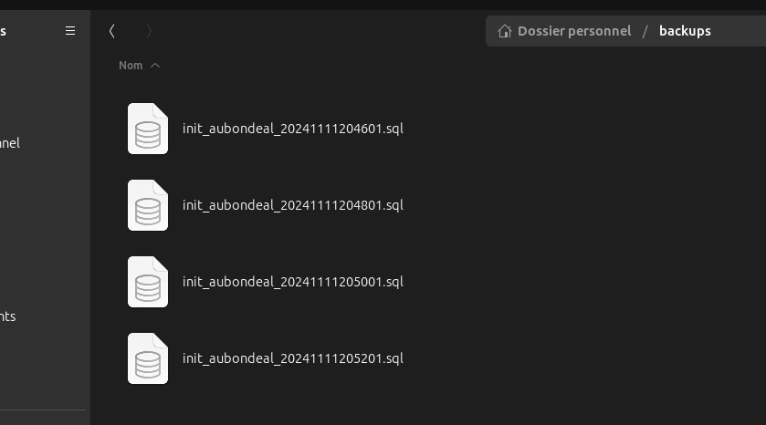

<a href="../README.md">
  
  </a>


# Documentation : Règles de sauvegarde

# Sommaire

- [Sauvegardes Automatiques avec Cron](#sauvegardes-automatiques-de-base-de-données-avec-cron)
- [Presentation](#presentation)
- [Mise en place ](#mise-en-place)
- [Planifier la sauvegarde avec cron ](#planifier-la-sauvegarde-avec-cron)
- [Plusieurs cas de sauvegardes ](#plusieurs-cas-de-sauvegardes)
- [Explication des Étoiles dans Cron](#explication-des-étoiles-dans-cron)
- [Vérifier les sauvegardes](#vérifier-les-sauvegardes)
- [Tester le script](#tester-le-script)
- [Supprimer les sauvegardes automatiques](#supprimer-les-sauvegardes-automatiques)
- [Vérification de la suppression ](#vérification-de-la-suppression)
- [Sauvegardes automatiques avec pg_dump ](#sauvegardes-automatiques-avec-pg_dump)


## Sauvegardes Automatiques de Base de Données avec Cron


## Presentation

Cette documentation explique comment configurer une tâche cron pour effectuer des sauvegardes automatiques de votre base de données en utilisant pg_dump. Ce guide est destiné aux utilisateurs de PostgreSQL, mais peut être adapté pour d’autres bases de données.

# Mise en place

## Préparer un répertoire pour les sauvegardes

- Nous allons créer un répertoire dédié aux sauvegardes pour une meilleure organisation.

```
mkdir -p ~/backups
```

## Créer un script de sauvegarde

- Créez un script qui effectuera la sauvegarde. **Ce script copiera le fichier init_aubondeal.sql** dans le dossier de sauvegarde **avec une date dans le nom pour les versions successives.**

- Ouvrez un éditeur pour créer le script de sauvegarde, **par exemple backup_script.sh** :

```
nano ~/backup_script.sh
```

## Dans le fichier, ajoutez les lignes suivantes :

```
#!/bin/bash
# Répertoire de sauvegarde
BACKUP_DIR=~/backups
# Nom du fichier SQL original
FILE_TO_BACKUP=~/chemin/vers/init_aubondeal.sql
# Nom de la sauvegarde avec la date
BACKUP_NAME="init_aubondeal_$(date +%Y%m%d%H%M%S).sql"
# Copier le fichier dans le répertoire de sauvegarde
cp "$FILE_TO_BACKUP" "$BACKUP_DIR/$BACKUP_NAME"

```

- Sauvegardez le fichier, puis fermez l'éditeur.
- En suite nous allons rendre le script exécutable :

```
chmod +x ~/backup_script.sh
```

# Planifier la sauvegarde avec cron

Ouvrez le planificateur de tâches cron en éditant la crontab :

```
crontab -e
```

- ce qui (comme c'est la première fois que je l'utilise) nous emmene vers la selection suivante afin de chosir notre editeur de texte préféré ( nano)

```
crontab -e

no crontab for meodel - using an empty one

Select an editor.  To change later, run 'select-editor'.
  1. /bin/nano        <---- easiest
  2. /usr/bin/vim.tiny
  3. /usr/bin/code
  4. /bin/ed

Choose 1-4 [1]: 1
```

- ensuite tout en bas après la myriade de commentaires nous pouvons link notre **backup_script.sh** fraichement créé afin de définir une durée de sauvegarde

## Plusieurs cas de sauvegardes

- ajoutez la ligne suivante pour exécuter le script tous les jours à 2h du matin :

```
0 2 \* \* \* ~/backup_script.sh
```

## Explication des Étoiles dans Cron

- Les options cron sont organisées comme suit :

```
* * * * * command
│ │ │ │ │
│ │ │ │ └── Jour de la semaine (0-7, où 0 et 7 = dimanche)
│ │ │ └──── Mois (1-12)
│ │ └────── Jour du mois (1-31)
│ └──────── Heure (0-23)
└────────── Minute (0-59)
```

- Sauvegardez et fermez crontab.

Les cinq étoiles dans la syntaxe cron déterminent la fréquence d’exécution de la commande. Voici la signification de chaque position :

| Position | Symbole | Description                | Exemple                 |
| -------- | ------- | -------------------------- | ----------------------- |
| 1ère     | `*`     | Minutes (0 - 59)           | `0` pour 0 min          |
| 2e       | `*`     | Heures (0 - 23)            | `2` pour 2h du matin    |
| 3e       | `*`     | Jour du mois (1 - 31)      | `15` pour le 15 du mois |
| 4e       | `*`     | Mois (1 - 12)              | `6` pour juin           |
| 5e       | `*`     | Jour de la semaine (0 - 7) | `1` pour lundi          |

## Vérifier les sauvegardes

Les sauvegardes seront enregistrées dans le dossier ~/backups avec un nom de fichier unique comprenant la date et l’heure de la sauvegarde.

## Tester le script

- Pour vérifier que tout fonctionne correctement, exécutez le script manuellement une fois :

```
~/backup_script.sh
```

### Youpi ca marche



## Supprimer les sauvegardes automatiques

- Ouvrez crontab pour modifier les tâches planifiées :

```
crontab -e
```

- Trouvez la ligne correspondant à votre tâche de sauvegarde

- Supprimez cette ligne ou ajoutez un # au début pour la commenter (ce qui désactivera la tâche sans la supprimer).

- Enregistrez et quittez :

## Vérification de la suppression

- Vous pouvez vérifier que la tâche a bien été supprimée en listant vos tâches cron :

```
crontab -l
```

## Sauvegardes automatiques avec pg_dump

La commande suivante permet de créer des sauvegardes automatiques de votre base de données en utilisant pg_dump dans une tâche cron.

```
* * * * * pg_dump -h localhost -p 5432 -U (ton_nom_d'utilisateur) -F c (nom_de_ta_bdd) > (ton_chemin_d'accès)
```

## Explication de la Commande

- `* * * * *` : Définit l’intervalle de temps pour exécuter la commande.
- pg_dump : Utilitaire PostgreSQL pour réaliser une sauvegarde de la base de données.
  - `-h localhost` : Définit l’hôte de la base de données (localhost pour la machine locale).
  - `-p 5432` : Spécifie le port PostgreSQL (par défaut : 5432).
  - `-U (ton_nom_d'utilisateur)` : Nom d’utilisateur pour se connecter à la base de données.
  - `-F c `: Format de sortie c (format de sauvegarde personnalisé de PostgreSQL).
  - `(nom_de_ta_bdd)` : Nom de la base de données à sauvegarder.
  - `>` : Redirection de la sortie vers un fichier.
  - `(ton_chemin_d'accès)` : Chemin où enregistrer le fichier de sauvegarde (par ex., /backups/backup.sql).

## Exemple de Commande

Si vous souhaitez sauvegarder une base de données nommée my_database avec l'utilisateur db_user et stocker le fichier dans /backups/my_database_backup.sql, la commande sera :

```
* * * * * pg_dump -h localhost -p 5432 -U db_user -F c my_database > /backups/my_database_backup.sql

```


<a href="../README.md">
  
</a>
<a href="#sommaire">
  
</a>


