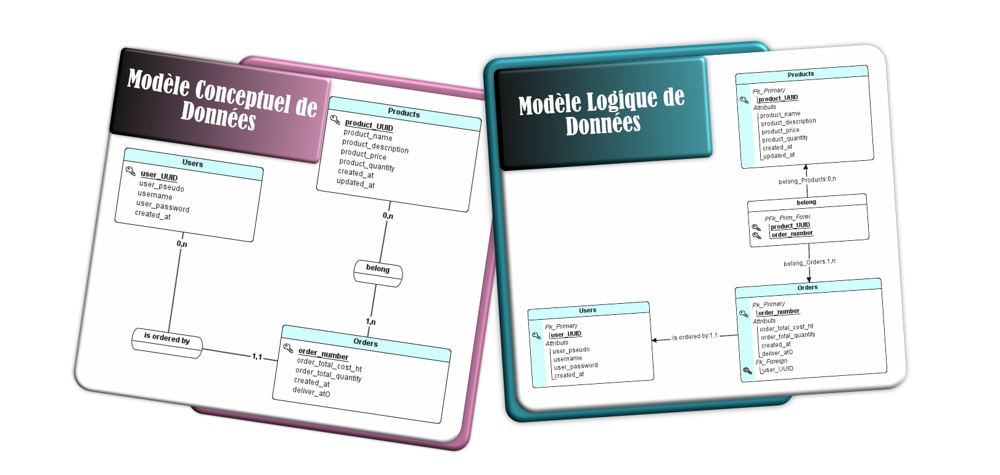

# Brief-PostegreSQL

<!--  -->

# Sommaire

- [Objectif et Consignes](#objectif-et-consignes)
- [Détails sur la Mission](#détails-sur-la-mission)
- [Livrables](#livrables)

# Navigation

- [MCD MLD](./doc/mcd-mld.md)
- [Règles de gestion](doc/regles-gestion.md)
- [Dictionnaire de données](./doc/BDD/dictionnaire-de-donnees.md)
- [Regles de sauvegarde](./doc/BDD/regles-de-sauvegardes.md)
- [Dictionnaire de données](./doc/BDD/dictionnaire-de-donnees.md)

# Objectif et Consignes

## Date de Livraison

Modalités pédagogiques
Travail individuel à rendre pour le **Mardi 12 Novembre 2024 9h00**

## Modalités d'évaluation

Revue de code sur GitHub : Les contributions seront analysées directement dans le dépôt pour évaluer la structure, l’optimisation et la conformité.

## Livrables

- [x] Repo Github
- [ ] Un fichier SQL format PostgreSQL
- [x] Des règles de gestion
- [x] Un dictionnaire de données
- [x] Une définition de l'acronyme MERISE dans la documentation
- [ ] Un document présentant les améliorations à apporter pour cette BDD / Diagrammes fournis
- [x] Un document expliquant le choix du SGBDR

#### Bonus :

- [ ] Un RBAC

## Critères de performance

- Exactitude : **La transposition des modèles MCD et MLD en une base de données PostgreSQL** doit être fidèle et correcte.
- Sécurité : Une **gestion efficace des rôles et permissions** dans la base de données.
- Documentation : **Clarté et complétude de la documentation fournie**, permettant à un tiers de comprendre facilement la structure et les choix effectués.

## Détails sur la Mission

## Contexte du projet

Vous allez contribuer à la création de "AuBonDeal", une plateforme de commerce en ligne 🚀. Cette initiative vise à proposer une solution performante pour la gestion des transactions commerciales, la mise en relation des vendeurs et acheteurs, et la gestion des produits.

---

### Analyse des Modèles de Données :

Examiner et comprendre le Modèle Conceptuel de Données (MCD) et le Modèle Logique de - Données (MLD) fournis.
Identifier les entités, attributs et relations clés afin de préparer une implémentation cohérente.
​

### Création de la Base de Données :

Traduire le MCD et le MLD en une base de données relationnelle fonctionnelle, à l’aide du langage SQL. Définir les tables, les clés primaires et étrangères, et les contraintes d’intégrité.

### Gestion des Opérations CRUD :

- Veiller à ce que la base de données permette des opérations CRUD efficaces et sécurisées.

- Porter une attention spéciale à la performance et à la sécurité (par exemple, la gestion des rôles et des permissions).
  ​

### Exportation et Sauvegarde de la Base de Données :

Réaliser l’exportation et la sauvegarde de la base de données en utilisant les commandes SQL appropriées.
Mettre en place une politique de rétention des sauvegardes, incluant la mise en place d’un script pour la sauvegarde journalière.
Documenter la politique de rétention des sauvegardes en expliquant la fréquence des sauvegardes, la durée de conservation, et les procédures de restauration. Cette documentation doit également préciser les menaces que la politique de rétention permet de contrer.

